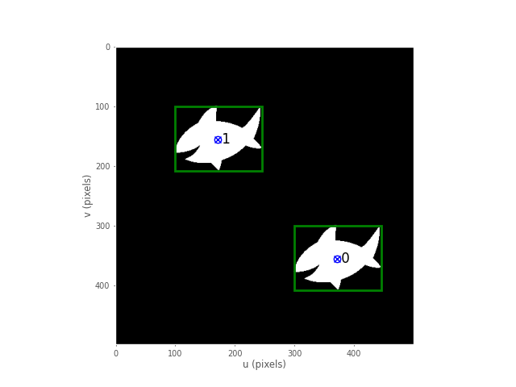
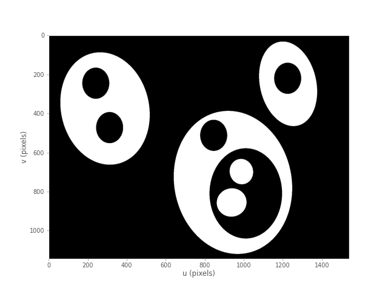
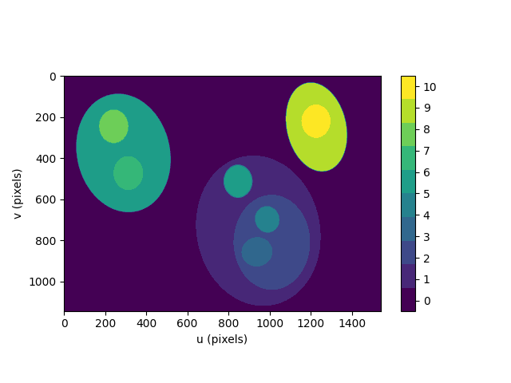
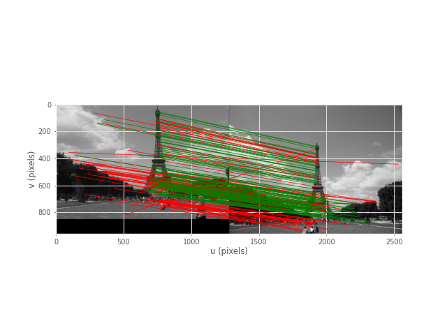

[](https://www.python.org/)
[](https://badge.fury.io/py/machinevision-toolbox-python)
[](https://github.com/petercorke/machinevision-toolbox-python/actions?query=workflow%3Abuild)
[](https://codecov.io/gh/petercorke/spatialmath-python)
[](https://opensource.org/licenses/MIT)
[](https://GitHub.com/petercorke/machinevision-toolbox-python/graphs/commit-activity)
[](https://GitHub.com/petercorke/machinevision-toolbox-python/stargazers/)

# Machine Vision Toolbox for Python

This is a Python implementation of the [Machine Vision Toolbox for MATLAB<sup>&reg;</sup>](https://github.com/petercorke/machinevision-toolbox-matlab), which is a standalone component of the [Robotics Toolbox for MATLAB<sup>&reg;</sup>](https://github.com/petercorke/robotics-toolbox-matlab).

Spatial mathematics capability underpins all of robotics and robotic vision where we need to describe the position, orientation or pose of objects in 2D or 3D spaces.


* GitHub repository [https://github.com/petercorke/machinevision-toolbox-python](https://github.com/petercorke/spatialmath-python)      
* Documentation [https://petercorke.github.io/machinevision-toolbox-python](https://petercorke.github.io/spatialmath-python)
* Dependencies: `numpy`, `scipy`, `matplotlib`, `ffmpeg` (if rendering animations as a movie), `spatialmath-python`.


## Synopsis

Machine Vision Toolbox for MATLAB&reg; release 4.

The Machine Vision Toolbox (MVTB) provides many functions that are useful in machine vision and vision-based control.  It is a somewhat eclectic collection reflecting my personal interest in areas of photometry, photogrammetry, colorimetry.  It includes over 100 functions spanning operations such as image file reading and writing, acquisition, display, filtering, blob, point and line feature extraction,  mathematical morphology, homographies, visual Jacobians, camera calibration and color space conversion. With input from a web camera and output to a robot (not provided) it would be possible to implement a visual servo system entirely in MATLAB.

An image is usually treated as a rectangular array of scalar values representing intensity or perhaps range.  The matrix is the natural datatype for MATLAB and thus makes the manipulation of images easily expressible in terms of arithmetic statements in MATLAB language.  Many image operations such as thresholding, filtering and statistics can be achieved with existing MATLAB functions.

Advantages of the Toolbox are that:

  * the code is mature and provides a point of comparison for other implementations of the same algorithms;
  * the routines are generally written in a straightforward manner which allows for easy understanding, perhaps at the expense of computational efficiency. If you feel strongly about computational efficiency then you can always rewrite the function to be more efficient, compile the M-file using the MATLAB compiler, or create a MEX version;
  * since source code is available there is a benefit for understanding and teaching.


# Getting going

## Using pip

Install a snapshot from PyPI

```
% pip install machinevision-toolbox-python
```

## From GitHub

Install the current code base from GitHub and pip install a link to that cloned copy

```
% git clone https://github.com/petercorke/machinevision-toolbox-python.git
% cd machinevision-toolbox-python
% pip install -e .
```

# Examples


### Binary blobs

```matlab
>> im = iread('shark2.png');   % read a binary image of two sharks
>> idisp(im);   % display it with interactive viewing tool
>> f = iblobs(im, 'class', 1)  % find all the white blobs
f =
(1) area=7827, cent=(172.3,156.1), theta=-0.21, b/a=0.585, color=1, label=2, touch=0, parent=1
(2) area=7827, cent=(372.3,356.1), theta=-0.21, b/a=0.585, color=1, label=3, touch=0, parent=1
>> f.plot_box('g')  % put a green bounding box on each blob
>> f.plot_centroid('o');  % put a circle+cross on the centroid of each blob
>> f.plot_centroid('x');
```


### Binary blob hierarchy

We can load a binary image with nested objects

```matlab
>> im = iread('multiblobs.png');
>> idisp(im)
```


and request the blob label image which we then display

```matlab
>> [label, m] = ilabel(im);
>> idisp(label, 'colormap', jet, 'bar')
```


### Camera modelling

```matlab
>> cam = CentralCamera('focal', 0.015, 'pixel', 10e-6, ...
    'resolution', [1280 1024], 'centre', [640 512], 'name', 'mycamera')
cam = 
name: mycamera [central-perspective]                    
  focal length:   0.015                                 
  pixel size:     (1e-05, 1e-05)                        
  principal pt:   (640, 512)                            
  number pixels:  1280 x 1024                           
  pose:           t = (0, 0, 0), RPY/yxz = (0, 0, 0) deg
```
and its intrinsic parameters are

```matlab 
>> cam.K
ans =
   1.0e+03 *

    1.5000         0    0.6400
         0    1.5000    0.5120
         0         0    0.0010
```
We can define an arbitrary point in the world

```matlab 
>> P = [0.3, 0.4, 3.0]';
```
and then project it into the camera

```matlab
>> cam.project(P)
ans =
   790
   712
```
which is the corresponding coordinate in pixels.  If we shift the camera slightly the image plane coordiante will also change

```matlab 
>> cam.project(P, 'pose', SE3(0.1, 0, 0) )
ans =
   740
   712
```

We can define an edge-based cube model and project it into the camera's image plane

```matlab 
>> [X,Y,Z] = mkcube(0.2, 'pose', SE3(0, 0, 1), 'edge');
>> cam.mesh(X, Y, Z);
```


or with a fisheye camera

```matlab
>> cam = FishEyeCamera('name', 'fisheye', ...
'projection', 'equiangular', ...
'pixel', 10e-6, ...
'resolution', [1280 1024]);
>> [X,Y,Z] = mkcube(0.2, 'centre', [0.2, 0, 0.3], 'edge');
>> cam.mesh(X, Y, Z);
```


### Bundle adjustment

### Color space
Plot the CIE chromaticity space

```matlab
showcolorspace('xy')
lambda = [460:10:540 560:20:600];
[x,y]=lambda2xy(lambda*1e-9);
hold on
plot_point([x y]', 'printf', {' %d', lambda}, 'ko', 'MarkerFaceColor', 'k', 'MarkerSize', 6)
```


Load the spectrum of sunlight at the Earth's surface and compute the CIE xy chromaticity coordinates

```matlab
lambda = [400:5:700] * 1e-9; % visible light
sun_at_ground = loadspectrum(lambda, 'solar');
>> lambda2xy(lambda, sun_at_ground)
ans =
    0.3327    0.3454
>> colorname(ans, 'xy')
loading rgb.txt
ans =
    'antiquewhite4'
```

### Hough transform

```matlab
im = iread('church.png', 'grey', 'double');
edges = icanny(im);
h = Hough(edges, 'suppress', 10);
lines = h.lines();

idisp(im, 'dark');
lines(1:10).plot('g');

lines = lines.seglength(edges);

lines(1)

k = find( lines.length > 80);

lines(k).plot('b--')
```


### SURF features

We load two images and compute a set of SURF features for each

```matlab
>> im1 = iread('eiffel2-1.jpg', 'mono', 'double');
>> im2 = iread('eiffel2-2.jpg', 'mono', 'double');
>> sf1 = isurf(im1);
>> sf2 = isurf(im2);
```
We can match features between images based purely on the similarity of the features, and display the correspondences found

```matlab
>> m = sf1.match(sf2)
m = 
644 corresponding points (listing suppressed)
>> m(1:5)
ans = 
 
(819.56, 358.557) <-> (708.008, 563.342), dist=0.002137
(1028.3, 231.748) <-> (880.14, 461.094), dist=0.004057 
(1027.6, 571.118) <-> (885.147, 742.088), dist=0.004297
(927.724, 509.93) <-> (800.833, 692.564), dist=0.004371
(854.35, 401.633) <-> (737.504, 602.187), dist=0.004417
>> idisp({im1, im2})
>> m.subset(100).plot('w')
```


Clearly there are some bad matches here, but we we can use RANSAC and the epipolar constraint implied by the fundamental matrix to estimate the fundamental matrix and classify correspondences as inliers or outliers

```matlab
>> F = m.ransac(@fmatrix, 1e-4, 'verbose')
617 trials
295 outliers
0.000145171 final residual
F =
    0.0000   -0.0000    0.0087
    0.0000    0.0000   -0.0135
   -0.0106    0.0116    3.3601
>> m.inlier.subset(100).plot('g')
>> hold on
>> m.outlier.subset(100).plot('r')
>> hold off
```
where green lines show correct correspondences (inliers) and red lines show bad correspondences (outliers) 


### Fundamental matrix


